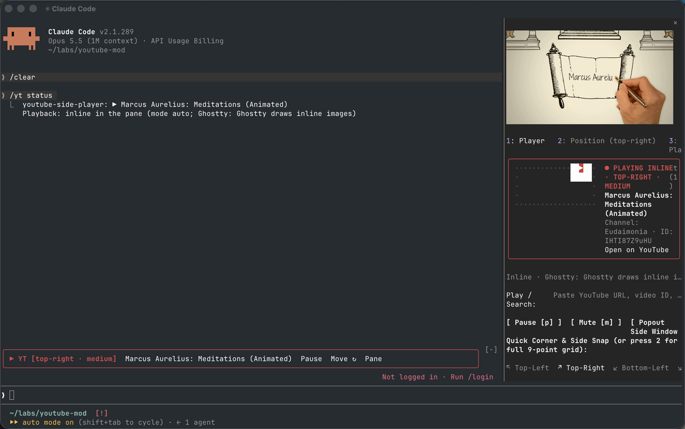

# claude-code-youtube-mod

> Watch YouTube right inside Claude Code, while you code.



In Ghostty or kitty the video plays inline, in Claude Code's side pane, with sound. Everywhere else it pops out into a floating, always-on-top macOS window.

## Install

```
/plugin marketplace add hemanth/claude-code-youtube-mod
/plugin install youtube-side-player@claude-code-youtube-mod
```

__Or from a clone:__

```sh
$ git clone https://github.com/hemanth/claude-code-youtube-mod
$ claude --plugin-dir ./claude-code-youtube-mod
```

Needs Claude Code `2.1.287+` and macOS.

## Usage

```
/yt marcus aurelius meditations animated
```

That's it: it searches YouTube and plays the top hit.

__More:__

```
/yt                          open the player pane
/yt <url | id | search>      play
/yt pause | resume
/yt stop                     stop and close the pane
/yt hide | show              hide the UI, keep listening
/yt pos <where> [size]       move the popout window (top-right, left-side, x,y,w,h ...)
/yt width <cols>             pane width
/yt mode auto|inline|window
/yt setup                    install the inline video tools
/yt status
```

Or just ask Claude: _"play some lofi on the side"_.

## Inline or popout?

Decided per session, from the terminal:

 1. Ghostty or kitty, not inside tmux: __inline__, in the side pane.
 2. Anything else, including the desktop app: __popout__ window.

`/yt status` tells you which one, and why.

## Dependencies

Inline video needs `yt-dlp` and `ffmpeg`. If they're on your `PATH`, they're used. If not, the first `/yt` play fetches them into `~/.claude/plugins/data/youtube-side-player/bin/`:

 * checksum-verified (SHA-256), never system-wide, no Homebrew.
 * yt-dlp updates itself weekly, as YouTube keeps changing.

Delete that folder to remove them.

## Development

```sh
$ claude plugin validate --strict .
$ claude plugin test .
$ swiftc -O native/YTPiPPlayer.swift -o bin/yt-pip -framework Cocoa -framework WebKit
```

## License

MIT © [Hemanth.HM](https://h3manth.com)
